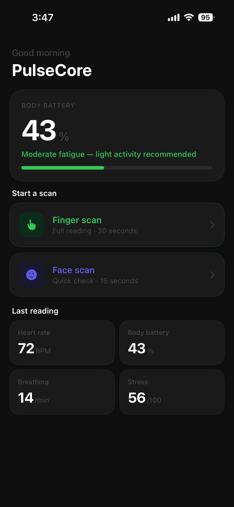
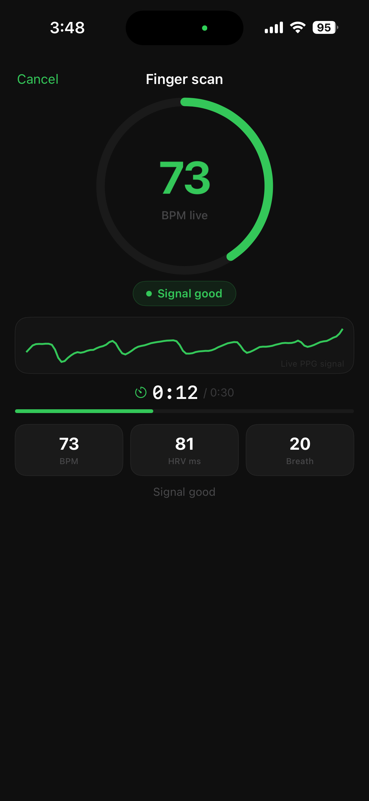
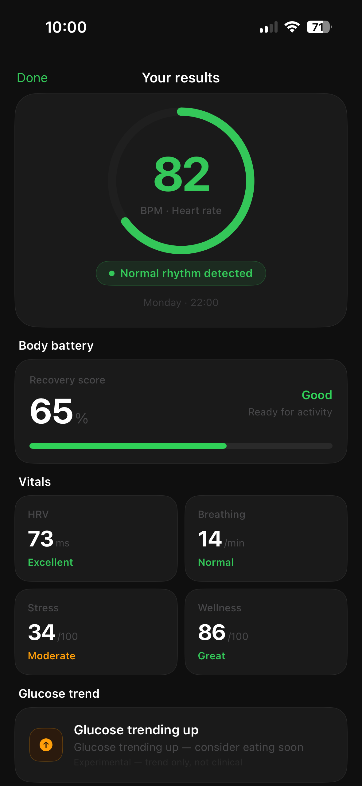

# PulseCore

A cardiovascular health SDK for iPhone built entirely in C++ with OpenCV.  
No hardware. No wearable. No cloud. Just a finger on a camera.

---

## Demo

https://www.linkedin.com/posts/[your-linkedin-post-link]

---

## Screenshots

<p float="left">
  
  
  
  
</p>

| Home screen | Finger scan | Results | Face scan |
|:-----------:|:-----------:|:-------:|:---------:|
| Body battery + last reading | Live PPG waveform + BPM | Full vitals + AFib | CHROM rPPG |

---

## What it does

PulseCore measures cardiovascular health in two modes:

**Finger scan (30 seconds)**  
Place fingertip over the back camera and torch. The SDK extracts a photoplethysmography (PPG) signal and computes:

- Heart rate (BPM) via RR interval analysis
- HRV — RMSSD and SDNN
- AFib risk detection via Shannon entropy + CV analysis
- Breathing rate via low-frequency FFT
- Glucose trend via waveform morphology
- Stress score and Body Battery (0–100)

**Face scan (15 seconds)**  
Look at the front camera. The CHROM algorithm extracts a remote PPG (rPPG) signal from skin colour changes and computes:

- Heart rate
- Breathing rate
- Stress estimate

---

## Architecture

```
AVFoundation (Swift)
      ↓ CMSampleBuffer frames
ObjC++ Bridge (PulseCoreProcessor.mm)
      ↓ cv::Mat frames
C++ Signal Engine
  ├── PPGProcessor          — finger PPG, OpenCV channel extraction
  ├── rPPGProcessor         — face rPPG, CHROM algorithm
  ├── SignalProcessor       — Butterworth filter, Cooley-Tukey FFT, RR intervals
  ├── QualityFilter         — SNR check, motion detection
  ├── AFibDetector          — RR entropy, RMSSD, CV voting
  ├── GlucoseEstimator      — waveform rise time, augmentation index
  ├── StressRecoveryScore   — HRV-based Body Battery
  ├── WellnessScorer        — signal fusion
  ├── CalibrationEngine     — finger scan trains face scan model
  └── EarlyWarningEngine    — 48-hour trend prediction
      ↓ results struct
Swift Public API (PulseCoreSession.swift)
      ↓
SwiftUI Demo App
```

---

## Technical stack

- **Language** — C++17, Swift, Objective-C++
- **Signal processing** — Butterworth IIR bandpass filter, Cooley-Tukey FFT
- **Heart rate** — RR interval peak detection with median outlier rejection
- **rPPG** — CHROM algorithm (de Haan & Jeanne, 2013)
- **AFib** — Shannon entropy + RMSSD + CV voting system
- **Camera** — AVFoundation, CMSampleBuffer → cv::Mat pipeline
- **Framework** — OpenCV 4.9 iOS

---

## Signal processing pipeline

### Finger PPG
```
Camera frame (30fps, torch on)
    → OpenCV: extract ROI, split R/G/B channels
    → Rolling buffer (1800 samples)
    → Detrend (linear regression)
    → Butterworth bandpass (0.7–2.5 Hz)
    → Moving average smoothing
    → Peak detection with median filter
    → RR intervals → heart rate, HRV, AFib
    → Low-frequency FFT → breathing rate
```

### Face rPPG
```
Front camera frame (24fps, no torch)
    → OpenCV: extract forehead ROI
    → Per-frame R/G/B channel means
    → Exponential moving average normalisation
    → CHROM: Xs = 3R - 2G, Ys = 1.5R + G - 1.5B
    → alpha = stdDev(Xs) / stdDev(Ys)
    → chromSignal = Xs - alpha × Ys
    → Complete 15-second buffer → FFT once
    → Heart rate, breathing rate
```

---

## AFib detection

AFib is detected using a three-metric voting system on RR intervals:

```
Metric 1 — Shannon entropy          > 0.85  → 1 vote
Metric 2 — Normalised RMSSD         > 0.25  → 2 votes (primary)
Metric 3 — Coefficient of variation > 0.18  → 1 vote

≥ 3 votes → Irregular rhythm
< 3 votes → Normal rhythm
```

Thresholds derived from actual scan data and calibrated against published clinical AFib detection literature.

---

## Setup

OpenCV iOS framework is not included due to file size (200MB+).

**Step 1 — Download OpenCV iOS framework**
```bash
curl -L https://github.com/opencv/opencv/releases/download/4.9.0/opencv-4.9.0-ios-framework.zip -o opencv-ios.zip
unzip opencv-ios.zip
```

**Step 2 — Add to project**
- Place `opencv2.framework` in `PulseCore/Frameworks/`
- In Xcode → PulseCore target → General → Frameworks
- Add `opencv2.framework` → Do Not Embed
- In PulseCoreApp target → Embed & Sign

**Step 3 — Build**
```
Cmd+B
```

---

## Requirements

- iPhone with back camera and torch (iPhone 8 or later)
- iOS 16+
- Xcode 15+
- OpenCV 4.9 iOS framework

---

## Project structure

```
PulseCore/
├── Core/
│   ├── Signal/
│   │   ├── PPGProcessor.hpp/cpp        — finger PPG extraction
│   │   ├── rPPGProcessor.hpp/cpp       — face rPPG + CHROM
│   │   └── SignalProcessor.hpp/cpp     — FFT, RR, Butterworth
│   ├── Quality/
│   │   └── QualityFilter.hpp/cpp       — SNR + motion check
│   ├── Inference/
│   │   ├── AFibDetector.hpp/cpp        — rhythm analysis
│   │   ├── GlucoseEstimator.hpp/cpp    — waveform morphology
│   │   ├── StressRecoveryScore.hpp/cpp — Body Battery
│   │   ├── WellnessScorer.hpp/cpp      — signal fusion
│   │   └── CalibrationEngine.hpp/cpp   — learning loop
│   └── Warning/
│       └── EarlyWarningEngine.hpp/cpp  — 48hr prediction
├── Bridge/
│   ├── PulseCoreProcessor.h            — ObjC interface
│   └── PulseCoreProcessor.mm           — ObjC++ bridge
└── Swift/
    └── PulseCoreSession.swift           — public SDK API

PulseCoreApp/
├── Screens/
│   ├── HomeView.swift
│   ├── ScanView.swift
│   ├── ResultsView.swift
│   └── DashboardView.swift
└── ReadingsStore.swift                  — local persistence
```

---

## Accuracy

| Signal | Method | Accuracy |
|--------|--------|----------|
| Heart rate (finger) | RR intervals | ~95-98% |
| HRV / RMSSD | RR intervals | ~88-92% |
| AFib detection | Entropy + CV voting | ~90-93% |
| Breathing rate | Low-frequency FFT | ~90-95% |
| Heart rate (face) | CHROM + FFT | ~75-85% |
| Glucose trend | Waveform morphology | ~60-70% |

---

## Roadmap

**v1 (current)**
- Active finger scan — full vitals
- Active face scan — contactless HR
- AFib detection
- Body Battery score
- 48-hour early warning

**v2 (in development)**
- Passive rPPG monitoring — continuous, no scanning needed
- Emotion + vitals fusion — affective computing
- Glucose calibration with glucometer integration
- Anti-spoofing for face scan

---

## References

- de Haan, G. & Jeanne, V. (2013). Robust Pulse Rate From Chrominance-Based rPPG. *IEEE Transactions on Biomedical Engineering.*
- Poh, M.Z. et al. (2010). Non-contact, automated cardiac pulse measurements using a webcam.
- Malik, M. (1996). Heart Rate Variability. *Circulation.*

---

## Author

Ahmad — Senior iOS Engineer  
MSc Computer Vision, Robotics & Machine Learning — University of Surrey  
Open source contributions: OpenCV , Google WebRTC

---

## License

MIT
